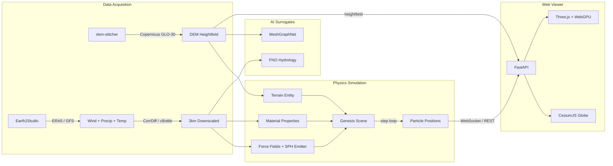

# Esimulab

GPU-accelerated environmental simulation platform coupling [Genesis](https://github.com/Genesis-Embodied-AI/Genesis) physics engine with AI-downscaled atmospheric data from [Earth2Studio](https://github.com/NVIDIA/earth2studio) and [PhysicsNeMo](https://github.com/NVIDIA/physicsnemo) surrogate models.

## Architecture



| Module | Purpose |
|--------|---------|
| `esimulab.terrain` | DEM + land cover fetching, UTM reprojection, Genesis heightfield conversion |
| `esimulab.atmo` | ERA5/GFS data, CorrDiff/cBottle downscaling, wind/precip extraction, material mapping |
| `esimulab.sim` | Genesis scene (terrain + SPH water + MPM soil + wind), simulation runner with time-varying BCs |
| `esimulab.surrogate` | PhysicsNeMo FNO hydrology surrogate, MeshGraphNet terrain graph conversion |
| `esimulab.web` | FastAPI server, CesiumJS globe selector, Three.js viewer, WebSocket frame streaming |
| `esimulab.cli` | CLI entry point with `serve` subcommand |

## Quickstart

### Prerequisites

- Python >= 3.11
- [uv](https://docs.astral.sh/uv/) package manager
- Docker + NVIDIA Container Toolkit (for GPU simulation)

### Install

```bash
git clone https://github.com/2imi9/esimulab.git
cd esimulab
uv sync --group dev
```

### Run (data-only, no GPU)

```bash
uv run esimulab \
  --bbox "-118.3,34.0,-118.2,34.1" \
  --datetime "2023-06-15T12:00:00" \
  --no-gpu
```

### Launch web viewer

```bash
uv run esimulab serve --port 8000
```

Open `http://localhost:8000` — CesiumJS globe for region selection, then Three.js terrain viewer.

### Full GPU simulation (Docker)

```bash
# Build
docker compose --profile gpu build genesis-sim

# Run end-to-end pipeline
docker compose --profile gpu run --rm genesis-sim \
  uv run python scripts/run_e2e_pipeline.py

# View results
uv run esimulab serve --port 8000
```

## Docker

| Service | Base Image | GPU | Purpose |
|---------|-----------|-----|---------|
| `genesis-sim` | `nvidia/cuda:12.4-devel` | Yes | Genesis + Earth2Studio + PhysicsNeMo |
| `web-viewer` | `python:3.11-slim` | No | FastAPI + static viewer |

Shared `./data/` volume for terrain, atmosphere, particle frames, and metadata.

## Development

```bash
uv sync --group dev            # Install all deps
uv run pytest                  # Run all 119 tests
uv run pytest -m "not gpu"     # Skip GPU-dependent tests
uv run ruff check src/ tests/  # Lint
uv run ruff format src/        # Format
uv run esimulab --help         # CLI usage
uv run esimulab serve --help   # Web viewer
```

### Project Structure

```
src/esimulab/
├── __init__.py
├── __main__.py          # python -m esimulab support
├── cli.py               # Click CLI with 'serve' subcommand
├── pipeline.py          # End-to-end orchestration
├── terrain/
│   ├── dem.py           # Copernicus DEM (dem-stitcher)
│   ├── landcover.py     # ESA WorldCover 10m
│   └── convert.py       # Heightfield → Genesis format
├── atmo/
│   ├── fetch.py         # ERA5 (ARCO) + GFS with auto-fallback
│   ├── downscale.py     # CorrDiff (25km→3km) + cBottle
│   ├── wind.py          # Wind forcing extraction
│   ├── precip.py        # Precipitation rate
│   └── material_mapping.py  # Temperature → water/soil properties
├── sim/
│   ├── scene.py         # Genesis scene (terrain+SPH+MPM+wind)
│   ├── runner.py        # Sim loop with time-varying BCs
│   └── soil.py          # MPM soil materials + land cover mapping
├── surrogate/
│   ├── fno.py           # FNO hydrology surrogate
│   └── meshgraphnet.py  # MeshGraphNet terrain graphs
└── web/
    ├── server.py        # FastAPI (globe, viewer, region, frames, WebSocket)
    ├── streaming.py     # WebSocket frame streaming + subsampling
    └── static/
        ├── globe.html   # CesiumJS region selector
        ├── index.html   # Three.js viewer
        ├── js/globe.js  # Globe interaction
        ├── js/main.js   # Sky shader + hypsometric terrain + particles
        └── shaders/wind_compute.wgsl  # WebGPU advection
```

## Verified End-to-End Pipeline

Tested on RTX 5090 laptop (24GB VRAM) in Docker:

```
Copernicus DEM (LA foothills, 395x331 @ 28m)
  → ERA5 reanalysis (wind 1.81 m/s, temp 15.7°C)
  → Temperature-based material properties (μ=0.0012 Pa·s)
  → Genesis terrain + SPH water + wind forces
  → 50 simulation steps (0.7 steps/s)
  → 10 particle frames exported (16M particles each)
  → Subsampled to 50k for web viewer (80ms, 586KB/frame)
```

## VRAM Budget (24 GB RTX 5090)

Run atmospheric AI inference **first**, then free weights and start Genesis. Sequential pattern keeps peak VRAM under 10GB.

| Component | Est. VRAM |
|-----------|-----------|
| Genesis + Taichi kernels | 1-2 GB |
| SPH solver (100k particles) | ~200 MB |
| MPM solver (50k particles) | ~150 MB |
| CorrDiff weights | ~4 GB |
| cBottle cascade | ~2 GB |
| **Peak (either phase)** | **~6-8 GB** |

## License

MIT
