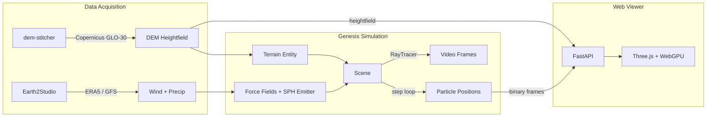

# Esimulab

GPU-accelerated environmental simulation platform coupling [Genesis](https://github.com/Genesis-Embodied-AI/Genesis) physics engine with AI-downscaled atmospheric data from [Earth2Studio](https://github.com/NVIDIA/earth2studio).

## Architecture



| Module | Purpose |
|--------|---------|
| `esimulab.terrain` | DEM + land cover fetching, UTM reprojection, Genesis heightfield conversion |
| `esimulab.atmo` | ERA5 atmospheric data, wind forcing extraction, precipitation rate computation |
| `esimulab.sim` | Genesis scene construction (SPH water, force-field wind, rain emitter), simulation runner |
| `esimulab.web` | FastAPI server, Three.js terrain/particle viewer, WebGPU wind advection shader |
| `esimulab.cli` | CLI entry point orchestrating the full pipeline |

## Quickstart

### Prerequisites

- Python >= 3.11
- [uv](https://docs.astral.sh/uv/) package manager
- Docker (optional, for containerized runs)
- NVIDIA GPU + CUDA (optional, for Genesis simulation)

### Install

```bash
git clone https://github.com/<your-org>/Esimulab.git
cd Esimulab
uv sync --group dev
```

### Run (data-only, no GPU)

```bash
uv run esimulab \
  --bbox "-119.1,33.4,-118.9,35.4" \
  --datetime "2023-06-15T12:00:00" \
  --steps 600 \
  --no-gpu
```

This fetches terrain and atmospheric data to `data/` without running the Genesis simulation.

### Run with web viewer

```bash
uv run esimulab \
  --bbox "-119.1,33.4,-118.9,35.4" \
  --no-gpu \
  --serve \
  --port 8000
```

Open `http://localhost:8000` to view the Three.js terrain and particle visualization.

### Run with GPU simulation

```bash
# Install GPU extras
uv sync --group dev --extra gpu

uv run esimulab \
  --bbox "-119.1,33.4,-118.9,35.4" \
  --datetime "2023-06-15T12:00:00" \
  --steps 1000 \
  --serve
```

## Docker

```bash
# Web viewer only (CPU)
docker compose up web-viewer

# Full stack with GPU
docker compose --profile gpu up

# Test Genesis import in container
docker compose run genesis-sim python -c "import genesis"
```

### Container Architecture

| Service | Base Image | GPU | Purpose |
|---------|-----------|-----|---------|
| `genesis-sim` | `nvidia/cuda:12.4` | Yes | Genesis simulation + data pipelines |
| `web-viewer` | `python:3.11-slim` | No | FastAPI server + static viewer |

Both containers share a `./data/` volume for simulation output exchange.

## Development

```bash
uv sync --group dev          # Install all deps
uv run pytest                # Run all 60 tests
uv run pytest -m "not gpu"   # Skip GPU-dependent tests
uv run pytest -m integration # Run integration tests only
uv run ruff check src/       # Lint
uv run ruff format src/      # Format
```

### Project Structure

```
src/esimulab/
├── __init__.py
├── cli.py              # Click CLI entry point
├── pipeline.py         # End-to-end orchestration
├── terrain/
│   ├── dem.py          # DEM fetching (dem-stitcher)
│   ├── landcover.py    # ESA WorldCover (rioxarray)
│   └── convert.py      # Heightfield -> Genesis format
├── atmo/
│   ├── fetch.py        # ERA5 via Earth2Studio
│   ├── wind.py         # Wind forcing extraction
│   └── precip.py       # Precipitation rate extraction
├── sim/
│   ├── scene.py        # Genesis scene builder
│   └── runner.py       # Simulation loop + frame export
└── web/
    ├── server.py       # FastAPI server
    └── static/
        ├── index.html  # Three.js viewer
        ├── js/main.js  # Terrain + particle rendering
        └── shaders/wind_compute.wgsl  # WebGPU advection
```

### Conventions

- **Commits:** conventional commits (`feat:`, `fix:`, `chore:`, `test:`, `docs:`)
- **Branches:** GitHub Flow (main + feature branches)
- **Tests:** pytest with markers `gpu`, `integration`, `slow`
- **Linting:** ruff (enforced via pre-commit)

## VRAM Budget (24 GB RTX 5090)

Run atmospheric AI inference **first**, then free weights and start Genesis simulation. Never load CorrDiff/cBottle and Genesis simultaneously.

| Component | Est. VRAM |
|-----------|-----------|
| Genesis runtime + Taichi kernels | 1-2 GB |
| Terrain heightfield (2000x2000) | ~15 MB |
| SPH solver (100k particles) | ~200 MB |
| Stable Fluid solver (128^3) | ~100 MB |
| RayTracer (1080p, spp=64) | ~500 MB |
| CorrDiff weights | ~4 GB |
| **Peak (either phase)** | **~6-8 GB** |

## License

MIT
